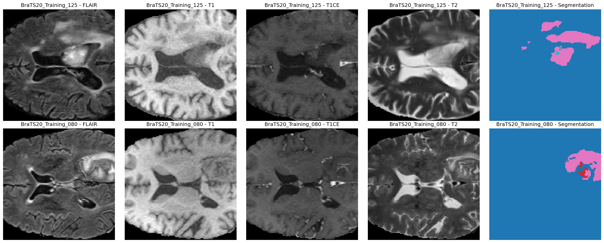
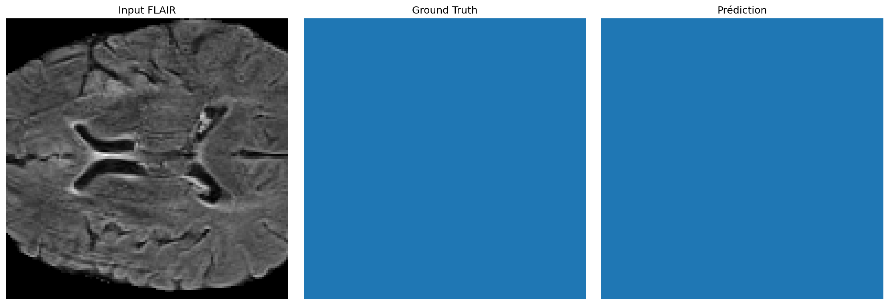
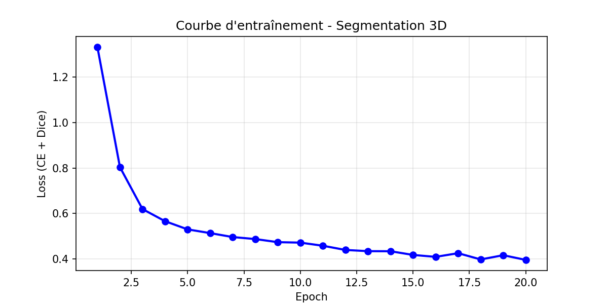
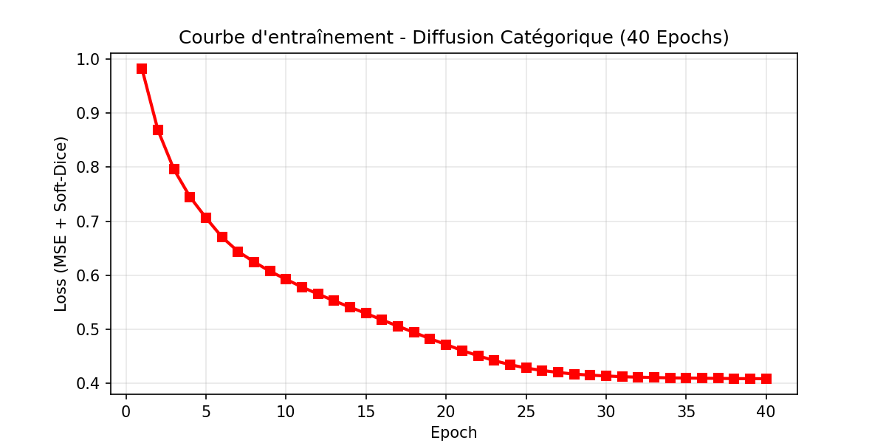

#  3D Tumor Segmentation & Progression Prediction with Conditional Diffusion Models

**Deep Learning · Medical Imaging · 3D Segmentation · Generative AI**

This project explores deep learning techniques for 3D medical image analysis, combining tumor segmentation with conditional diffusion models to investigate tumor progression prediction.

The repository includes a Jupyter notebook implementing the project pipeline, saved model checkpoints, training curves, and visual results.

##  Project Objectives

* **3D Tumor Segmentation:** identify and delineate tumor regions in volumetric medical images.
* **Conditional Diffusion Models:** explore generative modeling for tumor progression prediction.
* **Model Training and Evaluation:** monitor training behavior using saved learning curves.
* **Medical Image Visualization:** inspect segmentation predictions and progression-related outputs.
* **Reproducible Experimentation:** preserve model checkpoints and scheduler artifacts for further experiments.

##  Project Pipeline

The project combines two complementary tasks:

1. **Input preparation:** prepare volumetric medical imaging data for model processing.
2. **Tumor segmentation:** use a segmentation model to predict tumor regions.
3. **Diffusion modeling:** apply a diffusion-based approach to the progression prediction task.
4. **Training monitoring:** inspect the saved training curves.
5. **Result visualization:** analyze segmentation and progression-related outputs.

The exact model architectures, conditioning strategy, and preprocessing configuration should be consulted in the notebook before reproducing the experiments.

##  Visual Results

### 1. Medical Imaging Visualization



*Visualization associated with the project's medical imaging data.*

### 2. Tumor Segmentation Prediction



*Example output associated with the tumor segmentation task.*

### 3. Progression Prediction Results


*Visualization of the progression-related results saved in the repository.*

##  Training Curves

### Segmentation Model



### Diffusion Model



An additional diffusion training curve is available in [`outputs/diff_training_curve.png`](outputs/diff_training_curve.png).

These figures allow the training behavior to be inspected. Quantitative performance metrics should be reported separately and only when supported by evaluation results.

##  Technologies and Artifacts

### Technologies

* **Python** — model development and experimentation.
* **PyTorch** — deep learning model artifacts and training workflows.
* **Jupyter Notebook** — interactive experimentation and pipeline execution.

The complete dependency list and library versions should be verified from the notebook.

### Saved Model Artifacts

| File                                                       | Purpose                       |
| ---------------------------------------------------------- | ----------------------------- |
| [`segmentation_model.pth`](outputs/segmentation_model.pth) | Segmentation model checkpoint |
| [`diffusion_model.pth`](outputs/diffusion_model.pth)       | Diffusion model checkpoint    |
| [`ddpm_scheduler.pth`](outputs/ddpm_scheduler.pth)         | Diffusion scheduler artifact  |

### Repository Structure

```text
.
├── main_pipeline .ipynb
└── outputs/
    ├── brats_visualization.png
    ├── seg_prediction.png
    ├── progression_results (1).png
    ├── seg_training_curve.png
    ├── diff_training_curve.png
    ├── diff_training_curve_final.png
    ├── segmentation_model.pth
    ├── diffusion_model.pth
    └── ddpm_scheduler.pth
```

##  Getting Started

### 1. Clone the repository

```bash
git clone https://github.com/Meriamsikini/Segmentation-3D-et-pr-diction-de-progression-des-tumeurs-avec-mod-les-de-diffusion-conditionnels.git

cd Segmentation-3D-et-pr-diction-de-progression-des-tumeurs-avec-mod-les-de-diffusion-conditionnels
```

### 2. Create a Python environment

```bash
python -m venv .venv
```

Activate the environment:

**Windows — PowerShell**

```powershell
.\.venv\Scripts\Activate.ps1
```

**Linux / macOS**

```bash
source .venv/bin/activate
```

### 3. Install the required dependencies

Install Jupyter and PyTorch in the environment, then install the additional libraries required by the notebook.

```bash
pip install jupyter torch torchvision
```

> **Note:** This is a starting environment, not a complete dependency specification. Additional packages may be required. Check the notebook imports and model-loading code before running the pipeline.

### 4. Run the notebook

```bash
jupyter notebook
```

Open `main_pipeline .ipynb` and execute the cells in order.

**Data requirements:** the dataset location, directory structure, preprocessing parameters, and checkpoint-loading paths must match the configuration used by the notebook.

##  Evaluation

The project includes saved training curves and visual outputs. A complete evaluation should also report quantitative results using an appropriate test set.

Potential metrics include:

* **Dice Similarity Coefficient (DSC):** measures overlap between predicted and reference tumor regions.
* **Intersection over Union (IoU):** measures segmentation overlap.
* **Progression prediction metrics:** selected according to the type of output generated and the available ground-truth data.

No numerical performance claims are made here because verified metric values are not documented in this README.

##  Future Improvements

* Document the model architectures and conditional diffusion strategy in detail.
* Add a complete dependency file and reproducible training instructions.
* Report segmentation and progression prediction metrics on held-out data.
* Compare model predictions with reference annotations and observations.
* Improve 3D visualization and qualitative result analysis.

## ⚠️ Disclaimer

This project is intended for educational and experimental purposes in deep learning and medical image analysis. Its outputs are not validated medical diagnoses and must not replace professional clinical assessment.

##  Author

**Meriem Sikini**
---

*Exploring the intersection of 3D medical imaging, deep learning, and generative modeling.*
